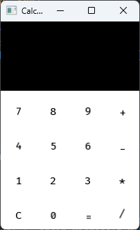

# A Calculator app in C++ using SFML
This is a GUI of a calculator that I made using cpp and SFML. It can perform basic tasks like addition, subtraction, multiplication and division. It does so using my own implementation of the shunting yard algorithm.

The executable is located in the bin folder with all required .dll files from sfml. You are free to use that or build the index.cpp file as per instructions from the official sfml dev tutorials page. The required library files are window, system and graphics. As of now the app is 
64-bit meaning it requires the -m64 tag at linking stage (could not figure out how to set it to 32-bit 💀). 

Building requires GCC to be installed as that is what I am using. You can use the following commands. 
(Please note you can optionally build the Button.cpp file even though it is provided in the bin folder)
```
g++ -g -I./include -c ./Source/Button.cpp index.cpp -o ./Bin/Main.o

g++ -g ./Bin/*.o -o ./Bin/Main.exe -L./Lib -lsfml-graphics -lsfml-window -lsfml-system -m64
```
The calculator UI looks as so (crap ik):


# !!! Important note !!!
When reized, the text and buttons warp and stretch to look even more hideous. I currently have temporarily dealt with it by simply resizing the window to its original state upon a resize event. Online resources state that this problem would be fixed with the setSize method of the window but for me it does not work. I don't what else to do so am open to suggestion.
